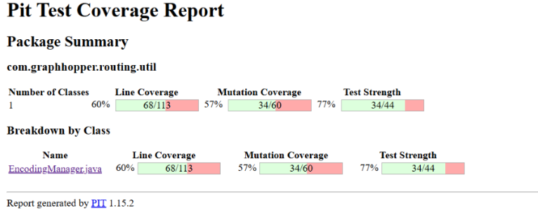
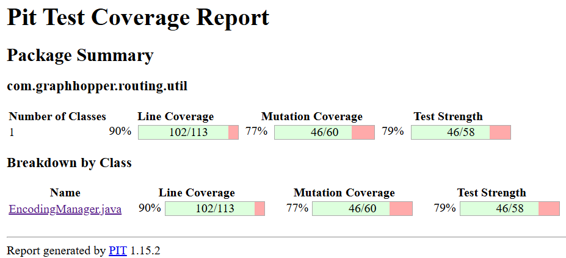

# Auteurs:

Lallia Diakite 

Tunwend-raabo Fahîma Carmen Dabo

# Choix des classes
Pour la tâche 2, nous avons choisi les classes **EncodingManager** et *à compléter* qui se trouvent respectivement dans les chemins `graphhopper\routing\util` et *à compléter*. Le choix de ces classes est basé sur le fait qu'elles contenaient beaucoup de lignes non couvertes par les tests fournis, ce qui fait que leur score était bas.

# Score de mutations avant les nouveaux tests
Avant l'ajout de nos tests, le lancement de Pitest nous a donné les scores suivants :

## EncodingManager

  
Le pourcentage de lignes couvertes de cette classe est de 60 %, soit 45 lignes qui ne sont jamais exécutées. Les tests couvrent 57 % des mutants détectés par Pitest, ce qui fait que 24 ont survécu ou n’ont pas été testés. En ce qui concerne l’efficacité des tests sur les mutants qu’ils couvrent (Test Strength), ils tuent 77 % des mutants qu’ils atteignent. Les 16 mutants restants sont sur les lignes non couvertes.

## *à compléter*

# Documentation des tests ajoutés
Le test `testFromPropertiesAndEncodingsAdvanced()` utilise JavaFaker car ce test demande plusieurs valeurs comme les noms de véhicules que JavaFaker peut générer pour tester la robustesse du code. De plus, il génère des valeurs aléatoires pour les champs des données au format JSON, ce qui permet de traiter les données inattendues.

---

## Test 1 : testBuilder_addAndBuild()

### Classe testée : EncodingManager

### Intention du test
Ce test vérifie le comportement du Builder d’EncodingManager :

- que l’ajout d’encodages (normaux et turn-cost) fonctionne avant la construction ;
- que `build()` crée correctement un EncodingManager contenant les encodages ajoutés ;
- et que le Builder devient verrouillé après l’appel à `build()` et refuse tout ajout ultérieur.

### Choix des données de test
- `SimpleBooleanEncodedValue("car_access", true)` : représente une capacité d’accès binaire classique (présente dans la majorité des profils).
- `DecimalEncodedValueImpl("car_average_speed", 4, 5, false)` : représente un encodage numérique typique (la vitesse), pour vérifier la compatibilité avec différents types.

Ces deux encodages permettent de tester deux branches différentes du builder (`add()` et `addTurnCostEncodedValue()`).

### Oracle
- `assertTrue(manager.hasEncodedValue("car_access"))` et `assertTrue(manager.hasTurnEncodedValue("car_average_speed"))` :  
Vérifie que les encodages ajoutés sont bien transférés au EncodingManager final.

- `assertThrows(IllegalStateException.class, () -> builder.add(access))` :  
Vérifie que le builder rejette toute modification après `build()`, ce qui est le comportement attendu d’un builder immutable après construction.

---

## Test 2 : testGetVehiclesAndToString()

### Classe testée : EncodingManager

### Intention du test
Le test vérifie le comportement sémantique lié à la construction d’un profil de véhicule. En soi, il s'assure que les encodages ajoutés sont correctement groupés par type de véhicule ; la méthode `getVehicles()` renvoie les bons identifiants et `toString()` renvoie une représentation cohérente du EncodingManager.

### Choix des données de test
- `bike_access` et `bike_average_speed` sont utilisés pour construire un profil homogène autour du véhicule “bike”.
- L’usage du même préfixe (`bike_`) permet de tester le mécanisme de regroupement automatique d’encodages par véhicule.

### Oracle
- `assertEquals(1, vehicles.size())` : un seul véhicule attendu (“bike”) ;
- `assertTrue(vehicles.contains("bike"))` : le nom est correctement détecté ;
- `assertEquals("bike", manager.toString())` : vérifie que la représentation textuelle du manager correspond à ce véhicule.

Ces assertions garantissent que le parsing des noms et la construction des profils véhicules fonctionnent comme prévu.

---

## Test 3 : testEncodedValueRetrievalAndExceptions()

### Classe testée : EncodingManager

### Intention du test
Le test a pour but de valider la récupération correcte des encodages ajoutés (booléens et décimaux de turn-costs), le comportement défensif en cas de clé d’encodage invalide et la détection que le EncodingManager nécessite la prise en charge des turn costs.  
Ce test couvre à la fois l'encodage des valeurs et les branches d’exception de la récupération d’encodages.

### Choix des données de test
- `walk_access` et `walk_turn_cost` : encodages simples, facilement distinguables, pour tester les deux types principaux (`BooleanEncodedValue` et `DecimalEncodedValue`).

Ces noms distincts facilitent la vérification de la correspondance correcte clé <-> encodage.

### Oracle
- `assertNotNull(manager.getBooleanEncodedValue("walk_access"))` et `assertNotNull(manager.getTurnDecimalEncodedValue("walk_turn_cost"))` :  
Les encodages valides doivent être retrouvés sans erreur.

- `assertTrue(manager.needsTurnCostsSupport())` :  
La présence d’un turn-cost encoding implique la nécessité de gérer les coûts de tournant (`turn_cost`).

- `assertThrows(IllegalArgumentException.class, ...)` pour des clés inconnues :  
Le système doit rejeter toute tentative d’accès à un encodage inexistant.

Cela garantit une robustesse de l’API et un comportement cohérent entre encodages valides et invalides.

---

## Test 4 : testFromPropertiesAndEncodingsAdvanced()

### Classe testée : EncodingManager

### Intention du test
Le test évalue le comportement de `EncodingManager.fromProperties()` et les fonctions associées comme `getTurnEncodedValues`, `getStringEncodedValue` dans divers cas. Il permet aussi de tuer plusieurs mutants générés par ces fonctions.  
Il traite les cas de version manquante, clé manquante, JSON invalide et doublon d’encodage. L’objectif est de valider la robustesse du parsing et de la désérialisation des propriétés du graphe.

### Choix des données de test
Utilisation de Faker : permet de générer des noms aléatoires et uniques (évite les collisions accidentelles et simule un cas réaliste de graphe).  
Les données invalides créées manuellement (JSON malformé, doublons, valeurs vides) permettent de couvrir toutes les branches conditionnelles internes.

### Oracle
- `assertNotNull(manager)` et vérifications sur `turnValues` et `strEv` :  
Confirment le succès du parsing complet dans le cas nominal.

- `assertThrows(IllegalStateException.class, ...)` :  
Chaque erreur simulée doit lever une exception spécifique, démontrant la validation interne stricte.

- `assertTrue(ex.getMessage().contains(duplicateName))` :  
Vérifie que les erreurs signalent les noms problématiques, ce qui est synonyme d'un bon diagnostic d’erreur.

En résumé, l’oracle de ce test s’appuie à la fois sur la non-nullité, la conformité des structures internes, et la détection correcte des erreurs via exceptions explicites.

## Test 5: 

### Classe testé:

### Intention du test

### Choix des données de test

### Oracle
---

## Test 6: 

### Classe testé:

### Intention du test

### Choix des données de test

### Oracle
---

## Test 7: 

### Classe testé:

### Intention du test

### Choix des données de test

### Oracle
---

## Test 8: 

### Classe testé:

### Intention du test

### Choix des données de test

### Oracle

# Score de mutations après les nouveaux tests
L'ajout des nouveaux tests a augmenté significativement la couverture du code, tué de nombreux mutants, ce qui a augmenté le score général des classes ciblées.

## EncodingManager

Nous pouvons voir que le score de la classe a considérablement augmenté. Le code est couvert à 90%, 77% des mutants sont couverts par les tests et les tests sont efficaces à 79%.

# Analyse des mutants détectés par les nouveaux tests

## EncodingManager 
L’ajout des nouveaux tests pour la classe EncodingManager détectent et tuent tous les mutants créés par les nouveaux tests.

### Méthode: toString()
### Mutation
Return une chaine de caractère vide.
### Test détecteur: testGetVehiclesAndToString
### Raison
Le test vérifie que manager.toString() retourne "bike" après ajout de bike_access. Le mutant renvoie une chaîne vide, ce qui fait échouer assertEquals("bike", manager.toString()).
---

### Méthode: getVehicles()
### Mutation
anyMatch(...) retourne toujours false.
### Test détecteur: testGetVehiclesAndToString
### Raison
Le test vérifie que "bike" est bien détecté comme véhicule. Si anyMatch retourne toujours false, aucun véhicule n’est détecté donc vehicles.contains("bike") échoue.
---

### Méthode: getVehicles()
### Mutation
replaceAll("_access", "") retourne une chaîne vide.
### Test détecteur: testGetVehiclesAndToString
### Raison
Le nom "bike_access" devient "", donc getVehicles() retourne "" au lieu de "bike". Cela fait échouer assertEquals("bike", manager.toString()).
---

### Méthode: getVehicles()
### Mutation
anyMatch(...) retourne toujours false.
### Test détecteur: testGetVehiclesAndToString
### Raison
Même logique que le 2eme mutant, donc cela fait échouer vehicles.contains(“bike”).
---

### Méthode: getVehicles()
### Mutation
contains(...) retourne toujours false
### Test détecteur: testGetVehiclesAndToString
### Raison
Le test dépend de la détection correcte de bike_average_speed pour confirmer “bike” comme véhicule. Si contains(...) retourne false, le lien entre bike_access et bike_average_speed n’existe plus.
---

Dans le cadre de la tâche 2, nous avons appliqué les tests de mutation avec PIT sur le module graphhopper-web-api, et plus précisément sur le package com.graphhopper.jackson.
L’objectif était d’évaluer la qualité et la robustesse des tests unitaires existants en mesurant leur capacité à détecter des mutations artificielles dans le code.

# Méthodologie :
# 1-Configuration du plugin PIT
Le plugin pitest-maven a été ajouté au fichier pom.xml du module web-api, avec le plugin pitest-junit5 pour supporter les tests JUnit 5.
# 2-Exécution de PIT
La commande suivante a été utilisée :
cd web-api
mvn org.pitest:pitest-maven:mutationCoverage \
  -DtargetClasses="com.graphhopper.jackson.*" \
  -DtargetTests="com.graphhopper.jackson.*Test" \
  -DtestPlugin=junit5

# Le rapport HTML est ensuite généré à l’emplacement :
web-api/target/pit-reports/index.html

# 3-Résultats obtenus
Nombre de classes analysées : 16
Line Coverage (JaCoCo) : 53 %
Mutation Coverage (PIT) : 52 %
Test Strength : 83 %
Ces résultats indiquent que plus de la moitié du code est couvert par des tests, et que la majorité des mutations sur les lignes couvertes sont détectées par les tests actuels.
# 4-Interprétation
La couverture de ligne (53 %) montre qu’il reste du code non testé.
Le taux de mutation (52 %) révèle qu’environ la moitié des mutants ne sont pas tués, ce qui signifie que certains cas ne sont pas encore couverts.
Le test strength (83 %) montre que les tests existants sont globalement efficaces, mais qu’il reste place à amélioration.

