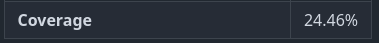
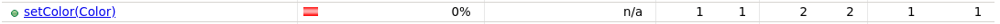
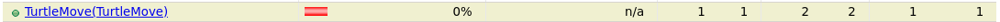

# Documentation Tests Unitaires

Emeric Laberge 20220275
Mathieu Morin 20163634

## Lien du fork du projet 
Lien du fork: https://github.com/Math-Morin/Makelangelo-software

## Test Coverage
Initial :  

Final :  

## Classes TurtleMoveTest et TurtleTest
Une classe de test TurtleMoveTest a été ajoutée pour tester la classe TurtleMove, dont la couverture pouvait etre améliorée.
La classe TurtleTest existait déjà. Ces classes ont été choisies, car nous sommes familier avec le concept de tortue (IFT-1015),
ce qui peut aider à concevoir les tests.

### TurtleMoveTest
Tous les tests pour la classe TurtleMove se trouvent dans [TurtleMoveTest](../src/test/java/com/marginallyclever/makelangelo/turtle/TurtleMoveTest.java).  
Toutes les méthodes testées se trouvent dans [TurtleMove](../src/main/java/com/marginallyclever/makelangelo/turtle/TurtleMove.java).

#### Test 1 - setColor()
Ce test s'assure que la fonction setColor() change correctement la couleur du TurtleMove pour celle désirée. Dans le
contexte d'un "MOVEMENT_TYPE.TOOL_CHANGE", la couleur est contenue dans le champs "x" de l'objet. Cette valeur est
initialisée à 1 dans le constructeur.

#### Test 2 - setDiameter()
Ce test vérifie que la fonction setDiameter() change correctement le diamètre. Dans le contexte d'un
"MOVEMENT_TYPE.TOOL_CHANGE", le diamètre est contenue dans la variable y. Cette valeur est initialisée à 2 dans le
constructeur.

#### Test 3 - equalsSame()
La fonction equals a été sélectionnée, car plusieurs branches n'étaient pas couvertes.
Ce test vérifie que la fonction equals() retourne vrai lorsqu'un objet TurtleMove est comparé avec lui-meme.

#### Test 4 - equalsDifferentClass()
Ce test vérifie que la fonction equals() retourne faux lorsqu'un objet TurtleMove est comparé avec un objet d'une classe différente.

#### Test 5 - equalsNull()
Ce test vérifie que la fonction equals() retourne faux lorsqu'un objet TurtleMove est comparé avec un objet null.

#### Test 6 - equalsDifferentType()
Ce test vérifie que la fonction equals() retourne faux si les deux objets TurtlesMove diffèrent par leur type de
mouvement.

#### Test 7 - equalsDifferentX()
Ce test vérifie que la fonction equals() retourne faux si les deux objets TurtlesMove diffèrent par leur coordonnées
en x.

#### Test 8 - equalsDifferentY()
Ce test vérifie que la fonction equals() retourne faux si les deux objets TurtlesMove diffèrent par leur coordonnées
en y.

#### Test 9 - TurtleMove()
Ce test vérifie que le constructeur retourne bien un nouvel objet TurtleMove qui est considéré égal à l'objet
qui lui a été passé en paramètre.

### Classe TurtleTest
Tous les tests pour la classe Turtle se trouvent dans [TurtleTest](../src/test/java/com/marginallyclever/makelangelo/turtle/TurtleTest.java).  
Toutes les méthodes testées se trouvent __à la fin__ du fichier [Turtle](src/main/java/com/marginallyclever/makelangelo/turtle/Turtle.java).

#### Test 10 - turtleCopyConstructor()
Ce test vérifie que le constructeur de copie produit bien un objet Turtle considéré égal a celui passé en paramètre.

#### Test 11 - lock()
Ce test vérifie que la fonction lock() vérouille bien la tortue.

#### Test 12 - unlock()
Ce test vérifie que la fonction unlock() dévérouille bien la tortue.

#### Test 13 - getDiameter()
Ce test vérifie que la fonction getDiameter() retourne bien la bonne valeur.

#### Test 14 - setX()
Ce test vérifie que la fonction setX() change bien la coordonnée en x pour la valeur donnée.

#### Test 15 - setY()
Ce test vérifie que la fonction setY() change bien la coordonnée en y pour la valeur donnée.

## Classe LineSegment2D

#### Test 16 - LineSegment2DToString()
Ce test vérifie que la fonction toString() implémentée dans la classe
LineSegment2D retourne bien la bonne valeur.

## Classe Paper

#### Test 17 - testPaperLeft()
Ce test vérifie que la fonction getPaperLeft() retourne bien la bonne valeur. 

#### Test 18 - testPaperRight() 
Ce test vérifie que la fonction getPaperRight() retourne bien la bonne valeur.

#### Test 19 - testPaperTop()
Ce test vérifie que la fonction getPaperTop() retourne bien la bonne valeur.

#### Test 20 - testPaperBottom()
Ce test vérifie que la fonction getPaperBottom() retourne bien la bonne valeur.

#### Test 21 - testMargins()
ce test verifie que la fonction setPaperMargin() retourne 0 si la marge est inférieure à 0 et 1 si la marge est supérieure à 1.

## Classe Generator_Polyeder.Transform

#### Test 22 - testTrans()
Ce test vérifie que la fonction trans de la classe Generator_Polyeder
retourne bien la bonne valeur.

#### Test 23 - testWalk()

Ce test vérifie que la fonction walk de la classe Generator_Polyeder 
retourne bien la bonne valeur.

#### Test 24 - testRotate() 
Ce test vérifie que la fonction rotate de la classe Generator_Polyeder
retourne bien la bonne valeur après avoir effectué une rotation.

#### Test 25 - testDup()
Ce test vérifie que la fonction dup de la classe Generator_Polyeder duplique bien l'objet.

