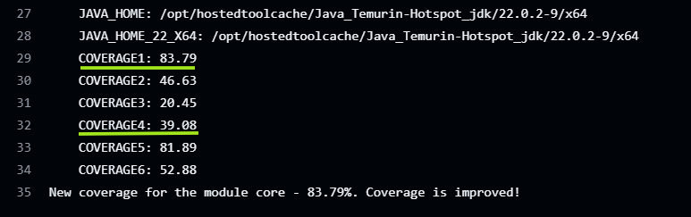

**Membre**:
- Hervé Ng'isse (20204609)
- Brittany Curry-Sharples (20205096)

**cas d'etude** : Graphhopper

**Lien vers le repository** : [Ici](https://github.com/h-mbl/graphhopper)

**Lien vers la documenttation** : [Ici](https://github.com/h-mbl/graphhopper/blob/f8e3f9b56620a999f5632d515215401bcf428de0/documentationFinal.docx)

**Taux de couverture :** 
