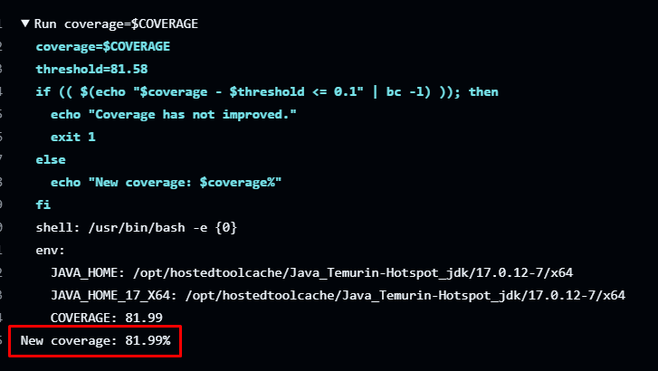

# Tâche 2 

Xavier Dontigny - 20215658

Nicholas Gebran - 20149284

## Étude de cas : [Jackson](https://github.com/umontreal-diro/jackson-core)

## [Lien vers le référentiel](https://github.com/Xaviotron/jackson-core)

## [Lien vers la page qui documente les nouveaux test unitaires](https://github.com/Xaviotron/jackson-core/blob/2.18/docs/testsdoc/DOC.md)

## Taux de couverture final: 81.99%

