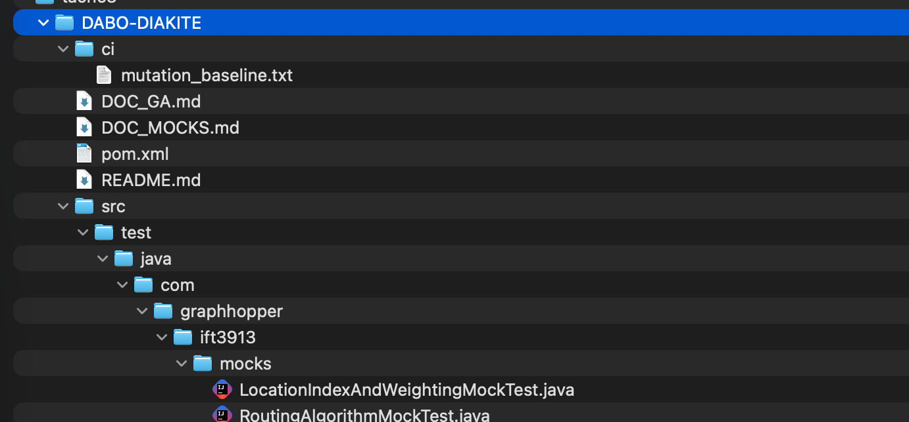

# Tâche 3 – Tests d’intégration (IFT3913)

## Équipe
**Fahima Dabo** 
**Lallia Diakité**

---

##  Objectif du travail

L’objectif de cette tâche est d’intégrer un **workflow GitHub Actions** capable de :
- exécuter automatiquement les tests JUnit et l’outil de mutation testing **PIT** ;
- **échouer** si le score de mutation est inférieur à la dernière exécution ;
- **documenter et justifier** les choix de conception pour cette intégration ;
- utiliser **Mockito** pour simuler des classes et tester des comportements isolés ;
- inclure une **note d’humour** (Rickroll) en cas d’échec du build.

---

##  Structure du dépôt:

tache3/
└── DABO-DIAKITE/
├── .github/
│ └── workflows/
│ └── build.yml : Workflow GitHub Actions
├── ci/
│ └── mutation_baseline.txt : Baseline du score de mutation (0.00)
├── src/
│ └── test/java/com/graphhopper/ift3913/mocks/
│ ├── RoutingAlgorithmMockTest.java
│ └── LocationIndexAndWeightingMockTest.java
├── pom.xml ← Configuration Maven (JUnit + PIT + Mockito)
├── DOC_GA.md ← Documentation de la GitHub Action
├── DOC_MOCKS.md ← Documentation des mocks et des tests

## Outils utilisés

- **Java 17**  
- **JUnit 5** : framework de test unitaire  
- **Mockito** : simulation de dépendances  
- **PIT Mutation Testing** : mesure de robustesse des tests  
- **GitHub Actions** : intégration continue  
- **Rickroll Action ** : note d’humour lors d’un échec

---

## Fonctionnement du Workflow

Le fichier [`build.yml`](.github/workflows/build.yml) définit les étapes suivantes :

1. **Installation de Maven** et configuration de Java 17.  
2. **Compilation + exécution des tests** (`mvn test`).  
3. **Analyse de mutation** avec PIT :
   - Calcul du score total (`mutation_score.txt`).
4. **Comparaison avec la baseline** (`ci/mutation_baseline.txt`) :
   - Le workflow échoue si le score baisse de plus de 0.05 %.
5. **Mise à jour automatique de la baseline** sur `main`.  
6. **Rickroll** en cas d’échec 🎶

---

##  Choix de conception

- **Structure isolée par dossier étudiant** : permet de livrer le travail sans modifier le dépôt principal du professeur.  
- **Baseline 0.00 %** : initialisée dans `ci/mutation_baseline.txt`, mise à jour automatique si le score augmente.  
- **Rickroll** : humour respectueux intégré dans la section finale du workflow.  
- **Mockito** : permet de simuler des dépendances complexes de GraphHopper pour tester sans exécuter le cœur du moteur.

---

##  Exemple de tests avec mocks

- `RoutingAlgorithmMockTest.java` : simule un algorithme de routage et vérifie que la réponse renvoyée est correcte même sans calcul réel.  
- `LocationIndexAndWeightingMockTest.java` : simule une classe d’indexation et de pondération pour valider les interactions.

---

##  Liens demandés

- **Dépôt GitHub du projet** : [https://github.com/Fahima-Carmen/IFT3913](https://github.com/Fahima-Carmen/IFT3913)
- **Dossier de la Tâche 3** : `tache3/DABO-DIAKITE/`
- **Documentation GitHub Actions** : [`DOC_GA.md`](DOC_GA.md)
- **Documentation des mocks** : [`DOC_MOCKS.md`](DOC_MOCKS.md)

---

##  Humour

> “Build failed... time for a break!”  
>  [Never Gonna Give You Up](https://www.youtube.com/watch?v=dQw4w9WgXcQ)

---

