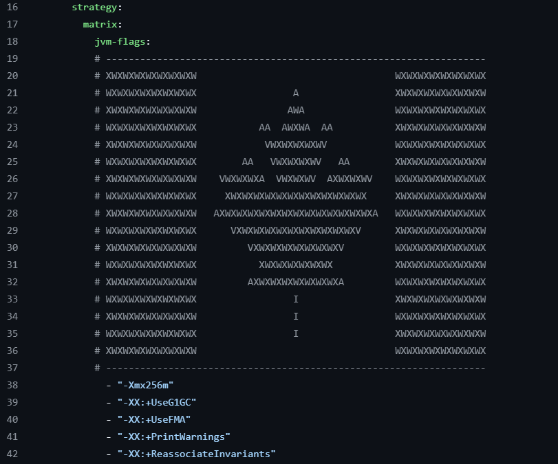

# Cas d'étude : Makelangelo

## Membres 
 - [Louis Malenfant-Poulin](https://github.com/Thorantt)
 - [Oscar Lavolet](https://github.com/Gelehead)

## Répertoire 
[Tache 3 - Makelangelo gelehead repo](https://github.com/Gelehead/Makelangelo-software)

## Documentation

### Modifications apportées:

Le premier problème qui nous a forcé à faire des modifications au fichier est le fait que chaque flag créait un fichier qui avait le même nom, ce qui faisait planter la GitHub action dès le deuxième flag.

Pour résoudre ce problème, nous avons ajouté un step qui permet de modifier le nom du fichier créé en fonction du nom du flag en cours. Cela permet d'avoir un fichier différent par flag. Pour ce faire, nous ajoutons simplement le nom du flag comme variable d'environnement.

Ensuite, nous avons rencontré le problème que le nom des flags pouvait contenir des caractères illégaux. Donc nous avons du ajouter une commande qui retire ces caractères. Nous avons choisi la commande sed, car elle permet de simplement trouver et remplacer les caractère qui ne sont pas des lettres. Cela pourrait causer des problèmes si nous choisissions des flags qui n'ont comme différence de nom que des caractères qui ne sont pas des lettres, mais ce n'est pas le cas des flags que nous avons choisi.

Les packages fail durant le build du projet, mais j'avoue que je ne crois pas pouvoir fixer ça.

### Flags et leurs justifications :

Xmx256m : Ce flag a été choisi, car il permet de savoir si le programme peut rouler sans problème, même si il n'a pas accès à beaucoup de mémoire. Cela est généralement important si on veut faire un programme qui va rouler sur des machines qui ne sont pas standardisées. Donc, 256m est une bonne quantité, car la vaste majorit des ordinateurs modernes sont capable d'octroyer sans problèmes 256m de mémoire.

XX:+UseG1GC : Ce flag a été choisi parce qu'il permet d'avoir des pause beaucoup plus régulières et beaucoup moins longues. Ça permet en effet de gérer le garbage collection de façon constante, permettant d'avoir beaucoup moins de latence si on veut utiliser cette application sur un serveur.

XX:+UseFMA : Ce flag permet de faire des clauls avec des floating points de façon beaucoup plus précise, ce qui permet notamment d'éviter l'aliasage du à des objets étant trop proches. Ça pourrait être très pertinent si on voulait modifier l'application pour lui permettre d'être très précise dans ses dessins.

-XX:+PrintWarnings : Ce flag permet simplement de voir les problèmes potentiels avec le code et savoir si certaines des features ne sont plus à jour en imprimant les warnings de la JVM.

-XX:+ReassociateInvariants : Ce flag permet d'optimiser les boucles en mettant les constantes à l'extérieur des dites boucles, donc si une boucle faisait toujours la même opération, ce flag permettrait que le programme ne fasse qu'une seule fois cette opération rendant le code plus rapide.

### Humour : 
Notre touche d'humour est qu'un de nos flag n'est pas comme les autres... C'est un drapeau du Canada!!!

